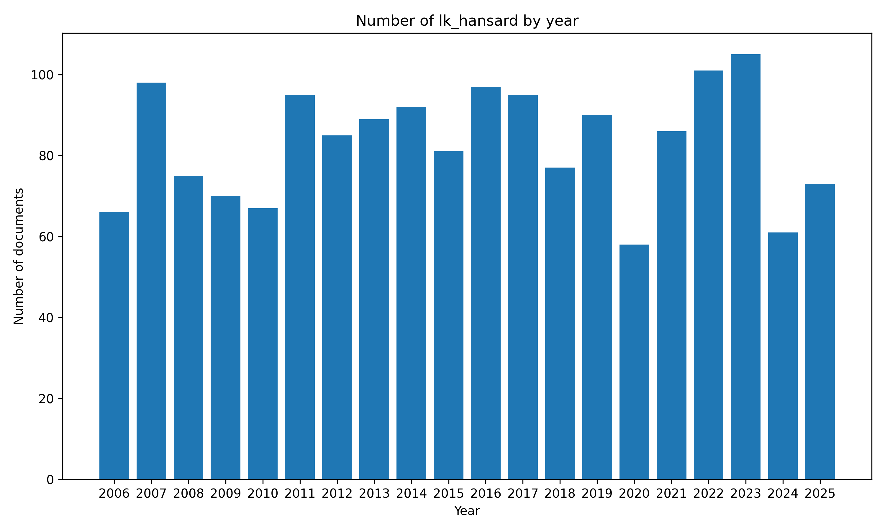

# Lk_Hansard

A collection of Lk_Hansard documents.

## Data Summary

|   |    |
| :-- | --: |
| Data Source | www.parliament.lk |
| Date Range | 2025-09-10 to 2025-09-10 |
| Number of Docs | 1 |
| Number of Docs with PDFs | 1 |
| Dataset Size | 0.0GB |

## Document Metadata Example

```json
{
    "num": "2025-09-10",
    "date_str": "2025-09-10",
    "description": "Hansard of September 10, 2025",
    "url_pdf": "https://www.parliament.lk/uploads/documents/hansard/1758017450079419.pdf",
    "url_metadata": "https://www.parliament.lk/en/business-of-parliament/hansards"
}
```

[source data](https://github.com/nuuuwan/lk_hansard/tree/data/data/lk_hansard/2020s/2025/2025-09-10-2025-09-10)

## Documents By Year



## 🤗 Hugging Face Datasets

- [nuuuwan/lk-hansard-docs](https://huggingface.co/datasets/nuuuwan/lk-hansard-docs)
- [nuuuwan/lk-hansard-chunks](https://huggingface.co/datasets/nuuuwan/lk-hansard-chunks)

## 20 Latest documents

- 2025-09-10 | `2025-09-10` | Hansard of September 10, 2025 | [data](https://github.com/nuuuwan/lk_hansard/tree/data/data/lk_hansard/2020s/2025/2025-09-10-2025-09-10)
