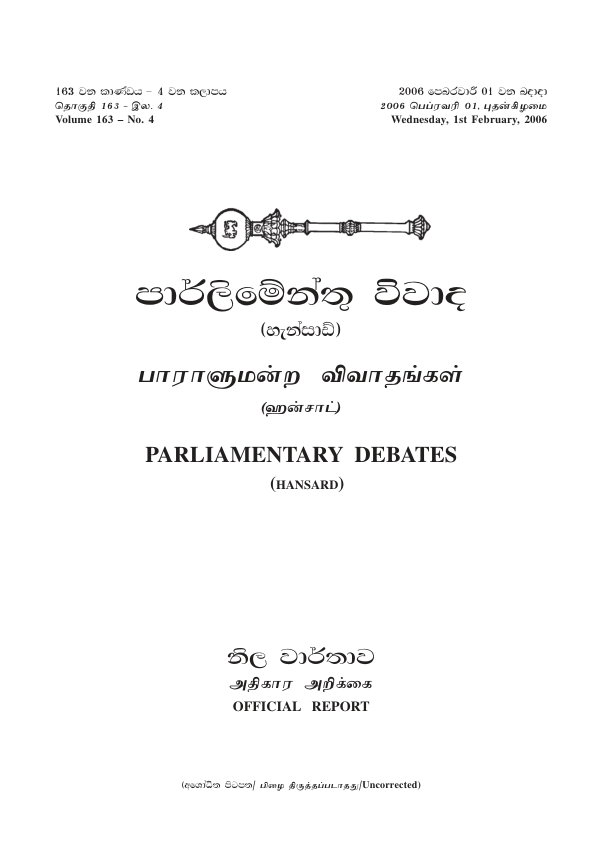

# 🇱🇰 #SriLanka Hansard `Dataset`




📜 **1,661** documents, from **2006-02-01** to **2025-09-10**, scraped from **[https://www.parliament.lk/en/business-of-parliament/hansards](https://www.parliament.lk/en/business-of-parliament/hansards)**.

📒 PDFs have been downloaded for **1,019** (**61%**) documents.

📚 Complete [Dataset](https://github.com/nuuuwan/lk_hansard/tree/data) (**8.4 GB**)
 - 🆓 Public data, & fully open-source.
 - 🙏 Please share & fork!

⏰ Updated **at least Daily**.

🪲 #WorkInProgress - Suggestions, Questions, Ideas, & [Bug Reports](https://github.com/nuuuwan/lk_hansard/issues) are welcome!

#OpenData #DataScience #DataForGood #ResearchData #NLP

## 📝 Example Metadata

```json
{
    "num": "2025-09-10",
    "date_str": "2025-09-10",
    "description": "Hansard of September 10, 2025",
    "url_pdf": "https://www.parliament.lk/uploads/documents/hansard/1758017450079419.pdf",
    "url_metadata": "https://www.parliament.lk/en/business-of-parliament/hansards"
}
```

[source data](https://github.com/nuuuwan/lk_hansard/tree/data/data/lk_hansard/2020s/2025/2025-09-10-2025-09-10)

## Documents By Year


## 🤗 Hugging Face Datasets


- 📄 [nuuuwan/lk-hansard-docs](https://huggingface.co/datasets/nuuuwan/lk-hansard-docs)
- 📦 [nuuuwan/lk-hansard-chunks](https://huggingface.co/datasets/nuuuwan/lk-hansard-chunks)

## 🆕 20 Latest documents

- 2025-09-10 | `2025-09-10` | Hansard of September 10, 2025 | [data](https://github.com/nuuuwan/lk_hansard/tree/data/data/lk_hansard/2020s/2025/2025-09-10-2025-09-10)
- 2025-09-09 | `2025-09-09` | Hansard of September 09, 2025 | [data](https://github.com/nuuuwan/lk_hansard/tree/data/data/lk_hansard/2020s/2025/2025-09-09-2025-09-09)
- 2025-08-22 | `2025-08-22` | Hansard of August 22, 2025 | [data](https://github.com/nuuuwan/lk_hansard/tree/data/data/lk_hansard/2020s/2025/2025-08-22-2025-08-22)
- 2025-08-21 | `2025-08-21` | Hansard of August 21, 2025 | [data](https://github.com/nuuuwan/lk_hansard/tree/data/data/lk_hansard/2020s/2025/2025-08-21-2025-08-21)
- 2025-08-20 | `2025-08-20` | Hansard of August 20, 2025 | [data](https://github.com/nuuuwan/lk_hansard/tree/data/data/lk_hansard/2020s/2025/2025-08-20-2025-08-20)
- 2025-08-19 | `2025-08-19` | Hansard of August 19, 2025 | [data](https://github.com/nuuuwan/lk_hansard/tree/data/data/lk_hansard/2020s/2025/2025-08-19-2025-08-19)
- 2025-08-07 | `2025-08-07` | Hansard of August 07, 2025 | [data](https://github.com/nuuuwan/lk_hansard/tree/data/data/lk_hansard/2020s/2025/2025-08-07-2025-08-07)
- 2025-08-06 | `2025-08-06` | Hansard of August 06, 2025 | [data](https://github.com/nuuuwan/lk_hansard/tree/data/data/lk_hansard/2020s/2025/2025-08-06-2025-08-06)
- 2025-08-05 | `2025-08-05` | Hansard of August 05, 2025 | [data](https://github.com/nuuuwan/lk_hansard/tree/data/data/lk_hansard/2020s/2025/2025-08-05-2025-08-05)
- 2025-07-25 | `2025-07-25` | Hansard of July 25, 2025 | [data](https://github.com/nuuuwan/lk_hansard/tree/data/data/lk_hansard/2020s/2025/2025-07-25-2025-07-25)
- 2025-07-24 | `2025-07-24` | Hansard of July 24, 2025 | [data](https://github.com/nuuuwan/lk_hansard/tree/data/data/lk_hansard/2020s/2025/2025-07-24-2025-07-24)
- 2025-07-23 | `2025-07-23` | Hansard of July 23, 2025 | [data](https://github.com/nuuuwan/lk_hansard/tree/data/data/lk_hansard/2020s/2025/2025-07-23-2025-07-23)
- 2025-07-22 | `2025-07-22` | Hansard of July 22, 2025 | [data](https://github.com/nuuuwan/lk_hansard/tree/data/data/lk_hansard/2020s/2025/2025-07-22-2025-07-22)
- 2025-07-11 | `2025-07-11` | Hansard of July 11, 2025 | [data](https://github.com/nuuuwan/lk_hansard/tree/data/data/lk_hansard/2020s/2025/2025-07-11-2025-07-11)
- 2025-07-09 | `2025-07-09` | Hansard of July 09, 2025 | [data](https://github.com/nuuuwan/lk_hansard/tree/data/data/lk_hansard/2020s/2025/2025-07-09-2025-07-09)
- 2025-07-08 | `2025-07-08` | Hansard of July 08, 2025 | [data](https://github.com/nuuuwan/lk_hansard/tree/data/data/lk_hansard/2020s/2025/2025-07-08-2025-07-08)
- 2025-06-30 | `2025-06-30` | Hansard of June 30, 2025 | [data](https://github.com/nuuuwan/lk_hansard/tree/data/data/lk_hansard/2020s/2025/2025-06-30-2025-06-30)
- 2025-06-20 | `2025-06-20` | Hansard of June 20, 2025 | [data](https://github.com/nuuuwan/lk_hansard/tree/data/data/lk_hansard/2020s/2025/2025-06-20-2025-06-20)
- 2025-06-19 | `2025-06-19` | Hansard of June 19, 2025 | [data](https://github.com/nuuuwan/lk_hansard/tree/data/data/lk_hansard/2020s/2025/2025-06-19-2025-06-19)
- 2025-06-18 | `2025-06-18` | Hansard of June 18, 2025 | [data](https://github.com/nuuuwan/lk_hansard/tree/data/data/lk_hansard/2020s/2025/2025-06-18-2025-06-18)

---


